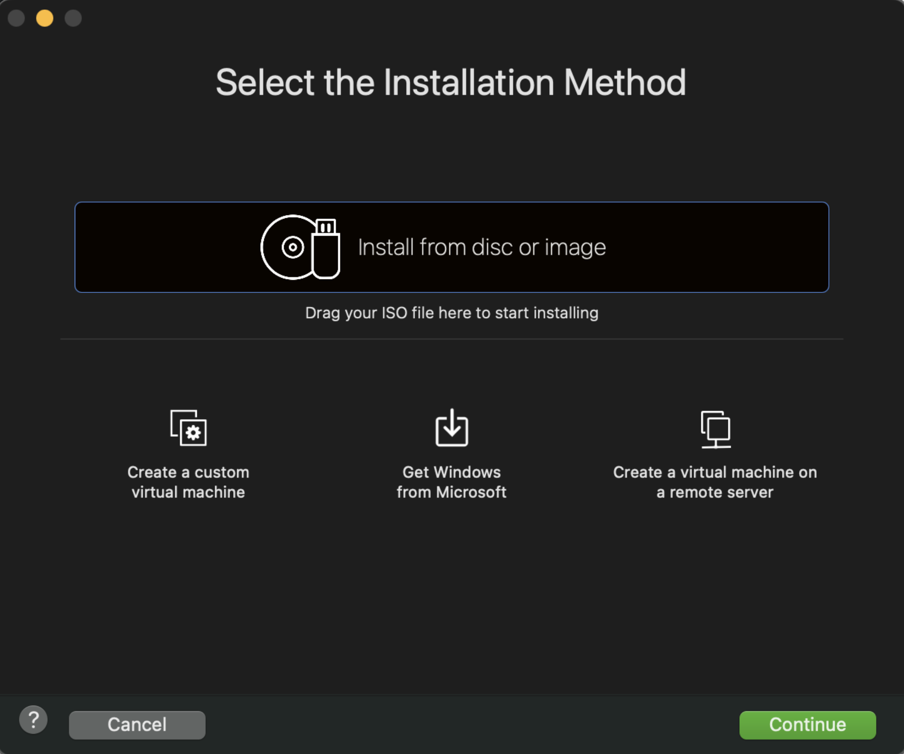
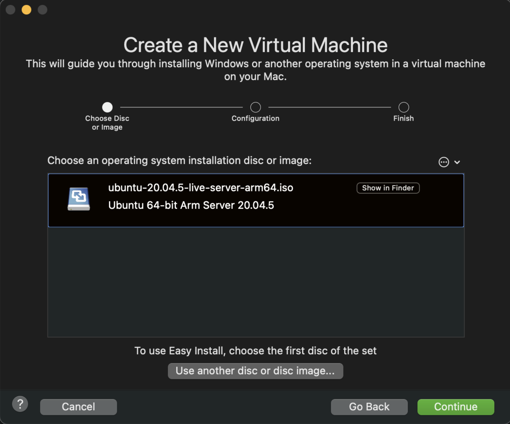
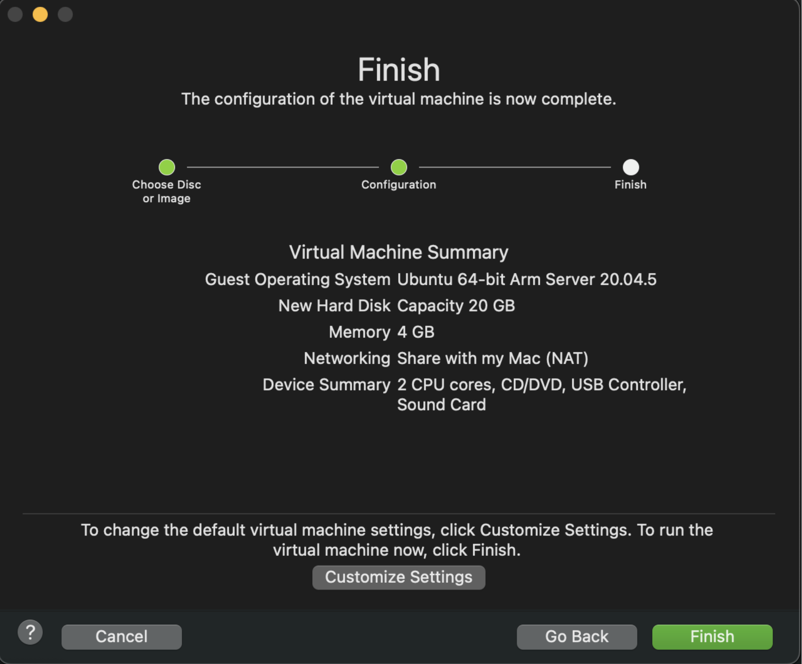
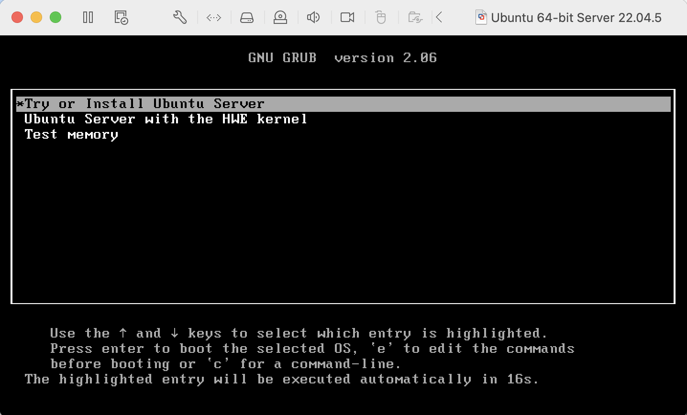
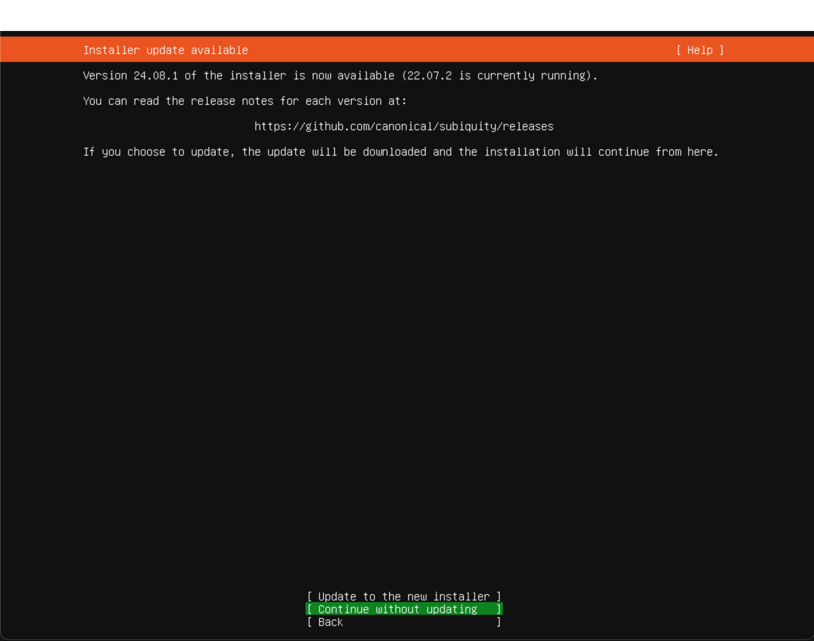
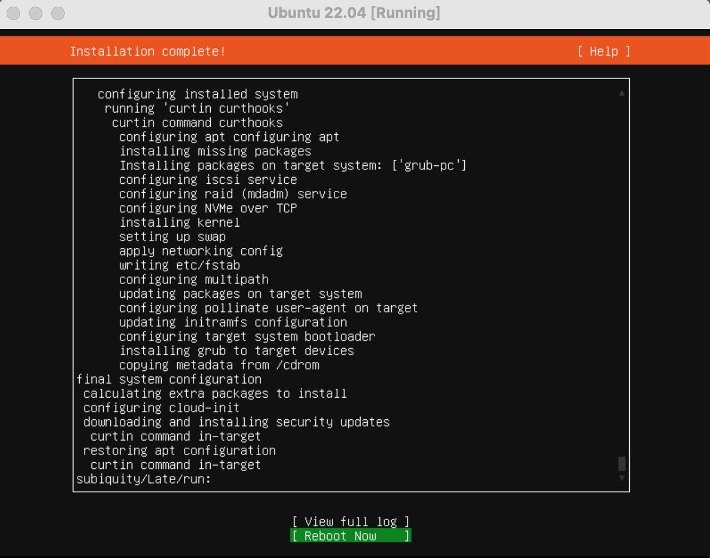
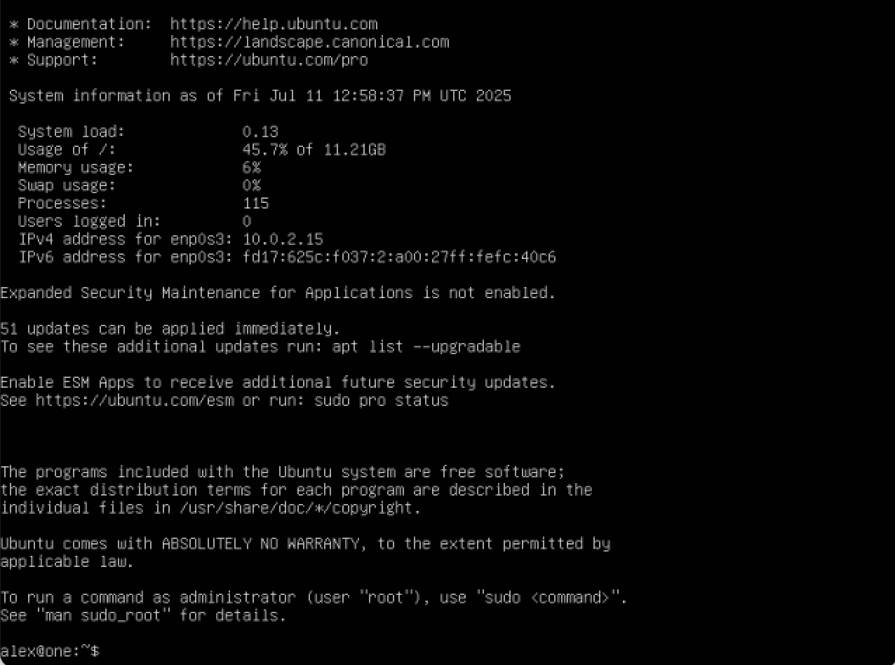
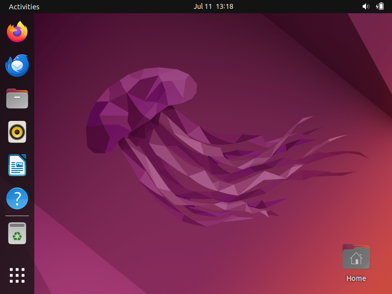
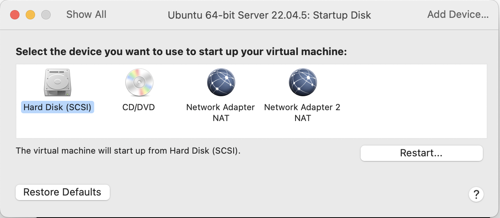

# COMP0182 Real-world Multi-agent Systems: Lab Sheet Zero

It is recommended to complete this lab sheet before attending the first lab session. It is possible that there will be installation quirks that require some time to resolve.

## Task 1: Installation of Ubuntu 22.04

For this course, everyone must use Ubuntu 22.04. This version of Ubuntu is compatible with ROS 2 (Humble) which you will be using in the following lab sessions. 

It is strongly recommended to dual boot Ubuntu 22.04 rather than use a virtual machine. 

### Installation options (Windows/macOS):

- **Option 1: Install Ubuntu 22.04 Dual Boot with Windows 11 (Highly recommended)**
- **Option 2: Install using a virtual machine with macOS**

N.B.: In a scenario where you are using macOS and have difficulties using the virtual machine set-up, a machine will be provided for use in the lab sessions. 

### Option 1: Install Ubuntu 22.04 Dual Boot with Windows 11 (Highly recommended)
Adapted from https://medium.com/@supermellow.ai/first-step-to-programming-how-to-dual-boot-windows-11-and-ubuntu-22-04-2-96d0be38fc2b and https://gcore.com/learning/dual-boot-ubuntu-windows-setup


**1. Prerequisites:**

- A Windows 11 computer
- At least 25GB of free disk space for Ubuntu 22.04
- A USB drive with at least 8GB
- An internet connection
- Access to your BitLocker key

**2. Create a new disk partition**

Type "disk partition" into the Windows search bar. You will see the following window:

_image_

Right click on your main drive and click "Shrink Volume".

Enter the amount of space to shrink - this is the space that Windows will no longer have access to. It is recommended to use at least 25GB, you can use more depending on the size of your drive.

Leave the space **unallocated** so that Ubuntu 22.04 can access it for installation.

**3. Back up your BitLocker recovery key.**

Next find your BitLocker recovery key. It is possible that you will require it to re-enter Windows after you have installed Ubuntu 22.04. 

To do so type "BitLocker" into your Windows search bar. You will have the option to print the key or save it to a drive. It is also optional to link the key to your online Microsoft account so that it is accessible from another device (recommended).

**4. Prepare the Ubuntu 22.04 installer**

Download the desktop image from https://releases.ubuntu.com/jammy/. 

Once it has downloaded you can use Rufus https://rufus.ie/en/ to easily create a bootable USB drive. 

Open Rufus, select the USB drive that has been inserted into your laptop and then select the downloaded Ubuntu 22.04 desktop image. Start the Rufus tool.

**5. Insert the USB and in the GRUB bootloader choose to boot from the USB, selecting "Try or Install Ubuntu"**

**6. Select "Install Ubuntu", connect to the MSc_IoT Wi-Fi network then continue to the following screen where you will select "Something else".**

**7. Assign the free space and select "Ext4 journaling file system" to the majority of the space you have made available. Save at least 4GB to create a swap area.**

**8. Once complete you will be prompted to restart your computer. The installation should be complete.**

N.B. If you have a discrete graphics card you may need to undergo some extra steps. This depends on if Ubuntu boots up successfully after installation. The steps can vary depending on the graphics card. Generally, for NVIDIA graphics cards you will need to:

1. Enter the GRUB bootloader and press "e" on the keyboard.
2. On the line titled "linux" add "nomodeset" to the end of the line.
3. When Ubuntu boots you will need to install the recommended NVIDIA drivers.
4. Once installed you may need to set the Nvidia card as the default graphics card for your Ubuntu system.

### Option 2: Install Ubuntu 22.04 using a virtual machine with macOS

**1. Download a Virutal Machine Platform**
There are several options for virtual machine platforms for macOS, feel free to use any other platform. In this lab sheet, we will be using VMWare Fusion for demonstration. First, go to the website: https://www.broadcom.com/. 

1. In the upper-right corner, click Support Portal > Go To Portal. 
2. Register and log in to your Broadcom account.
3. Once logged in, click on My Downloads.
4. Click the "Free Software Downloads available HERE" link.
5. Click on VMware Fusion.
6. Select the latest version of VMWare Fusion to download.

**2. Download Ubuntu 22.04 image**
Download the Ubuntu image file from the official website [here](https://cdimage.ubuntu.com/releases/jammy/release/). Select the Server install image for 64-bit ARM (ARMv8/AArch64). Normally, we prefer to download the desktop image which can give us the graphical user interface directly after installation. Unfortunately, the desktop image for Ubuntu 22.04 ARM64 is no longer available. But we can install the server image first, and install the GUI desktop manually.

**3. Create New Virtual Machine for Ubuntu**
Open VMWare Fusion, on the top-left corner, select New: 


Drag the .iso file you just downloaded here. Follow the instructions, it is recommended that you chose at least 50 GB for Hard Disk size.





**4. Finish Installation Setup**
After creating the Virtual Machine, select the Ubuntu System and press Start. Then Select Try or Install Ubuntu Server.



In the setup, just skip everything and select `Continue` or `Done` at each step.


After a few minutes, you will see `Install Complete` in the top left corner, and the system will turn to an update stage. Select `Rebbot Now`.



**5. Install GUI**
After reboot, you will be led to the Ubuntu Server terminal, as we need to use simulation for further work, a GUI desktop is necessary. First, type the username and password you just set to log in.



To install the GUI, run the following command in the terminal.

```bash
sudo apt update
sudo apt install ubuntu-desktop
```

After installing and rebooting, the Ubuntu desktop in the virtual machine has been successfully installed and is ready to use.

```bash
sudo reboot
```


**6. (Optional) Select the disk startup of your virtual machine**
Go to the settings menu of the virtual machine, and check the boot order in the startup tab.

Select the Hard Disk to start up the virtual machine.
Then do `sudo reboot` to see if it works.




These are the general steps, though please research your specific use-case depending on the graphics card in your computer. Guidance will be available in the labs.


## Task 2: Installation of ROS 2 Humble

Now that Ubuntu 22.04 is installed, you cab use deb packages to install ROS 2 Humble as seen here https://docs.ros.org/en/humble/Installation/Ubuntu-Install-Debs.html

1. Make sure you have a locale which supports UTF-8

```
locale  # check for UTF-8

sudo apt update && sudo apt install locales
sudo locale-gen en_US en_US.UTF-8
sudo update-locale LC_ALL=en_US.UTF-8 LANG=en_US.UTF-8
export LANG=en_US.UTF-8

locale  # verify settings
```

2. Set up your sources.

To add the ROS 2 apt repository to your system, first ensure that the Ubuntu Universe repository is enabled.

```
sudo apt install software-properties-common
sudo add-apt-repository universe
```

3. Set up your keys.

```
sudo apt update && sudo apt install curl -y
export ROS_APT_SOURCE_VERSION=$(curl -s https://api.github.com/repos/ros-infrastructure/ros-apt-source/releases/latest | grep -F "tag_name" | awk -F\" '{print $4}')
curl -L -o /tmp/ros2-apt-source.deb "https://github.com/ros-infrastructure/ros-apt-source/releases/download/${ROS_APT_SOURCE_VERSION}/ros2-apt-source_${ROS_APT_SOURCE_VERSION}.$(. /etc/os-release && echo $VERSION_CODENAME)_all.deb" # If using Ubuntu derivates use $UBUNTU_CODENAME
sudo dpkg -i /tmp/ros2-apt-source.deb
```

4. Update your apt repositories and ensure your system is up to date.

```
sudo apt update
sudo apt upgrade
```

5. Install the desktop version of ROS 2 Humble (Recommended)

```
sudo apt install ros-humble-desktop
```

6. Install the development tools to build ROS packages.

```
sudo apt install ros-dev-tools
```

6. To make ROS 2 Humble available for use in the terminal:

```
echo "source /opt/ros/humble/setup.bash" >> ~/.bashrc
```

Now you can enter the following to use ROS 2 Humble: 
```
source ~/.bashrc
```

## Prepare Turtlebot3 Workspace

**1. Update your system**

```
sudo apt update
sudo apt upgrade
```

**2. Install Cartographer**

```
sudo apt install ros-humble-cartographer
sudo apt install ros-humble-cartographer-ros
```

**3. Install Navigation2**

```
sudo apt install ros-humble-navigation2
sudo apt install ros-humble-nav2-bringup
```

**4. Install Colcon Build Tools**
```
sudo apt install python3-colcon-common-extensions
```

**. Install Turtlebot3 Packages**

```
source /opt/ros/humble/setup.bash
mkdir -p ~/turtlebot3_ws/src
cd ~/turtlebot3_ws/src/
git clone -b humble https://github.com/ROBOTIS-GIT/DynamixelSDK.git
git clone -b humble https://github.com/ROBOTIS-GIT/turtlebot3_msgs.git
git clone -b humble https://github.com/ROBOTIS-GIT/turtlebot3.git
cd ~/turtlebot3_ws
colcon build --symlink-install
```

## Configure the environment

```
echo "source /opt/ros/humble/setup.bash" >> ~/.bashrc
echo "source ~/turtlebot3_ws/install/setup.bash" >> ~/.bashrc
echo "export TURTLEBOT3_MODEL=burger" >> ~/.bashrc
echo "export ROS_DOMAIN_ID=30" >> ~/.bashrc
source ~/.bashrc
```

## Talker Listener Exercise

In the next exercise you will edit and build a ROS package. 
